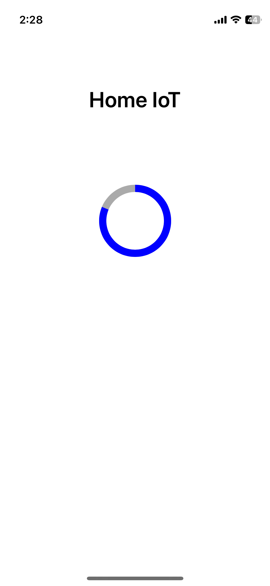

## LED Remotectrl

### Description
앱인벤터를 활용한 LED 전원 원격 컨트롤러

### Demo
<!--  -->
 
 

Design: [Figma Link](https://www.figma.com/proto/KW2mEczV87qqs2WHGGo9h1/Home-IoT?node-id=0-1&t=6QIobv1OtI4QVHdm-1)

### Environment
* OS: MACOS
* Skill: Node.js, Javascript, C, MariaDB
* Tools: Figma, VSCode, Postman, 

### Github Link
* IoTRestAPI : [Github Link](https://github.com/dong1270/IoTRestAPI.git)
* LEDModule  : [Github Link](https://github.com/dong1270/LEDModule.git)
* LEDClient  : [Github Link](https://github.com/dong1270/LEDClient.git)

